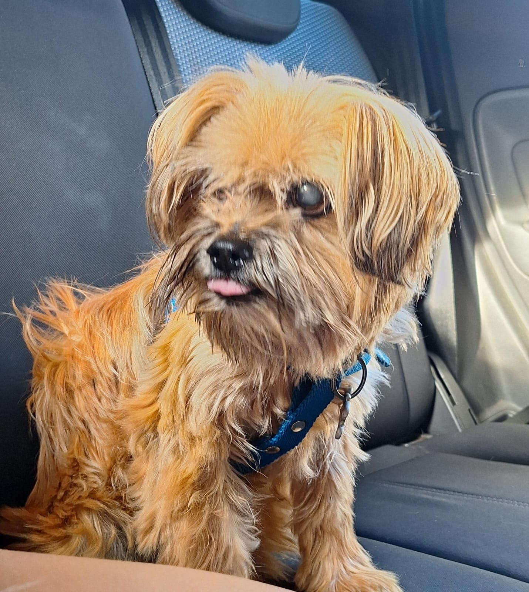

# Programación con objetos I
## Presentación Personal

### Datos Personales
- Mi nombre es Malena Lozano, tengo 19 años y vivo en Haedo.
- Estoy en el segundo año de la Tecnicatura en Programación, con el objetivo de hacer la Licenciatura en Informática luego.
- En un principio consideré hacer la Tecnicatura en Programación de Videojuegos pero me decidí a tener un título más general y más adelante especializarme.

### Otra Información
- Ya tenía una cuenta en github pero no recuerdo haberla usado jamás, así que digamos que es la primera vez.
- Fun fact: Tengo un perro con diabetes llamado Roco, les dejo una foto abajo para que lo vean.

